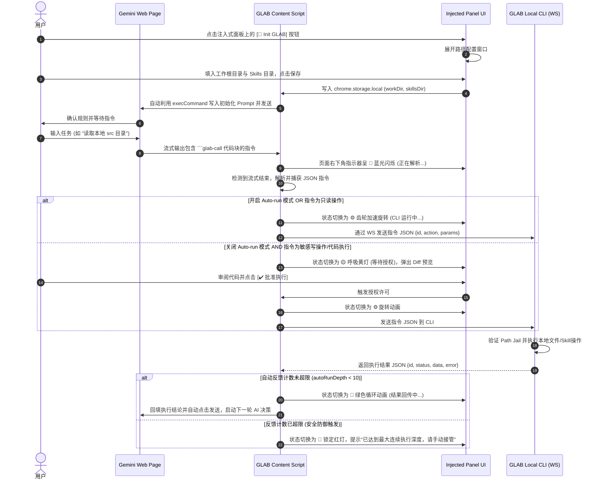

# **Gemini Local Agent Bridge (GLAB) 技术规约与指令协议设计文档**

## **1. 系统架构与通信流向**

本系统由 **Gemini Web 页面 (Content Script & 注入式侧边栏/浮窗 UI)**、**本地 CLI 服务 (WebSocket Server)** 两部分构成。放弃容易失去焦点的右上角 Popup 模式与割裂的 Chrome 官方 Side Panel，采用**“高度一体化的网页注入式浮动面板（Injected Glassmorphism Panel）”**作为交互控制中心。

### **1.1 系统架构拓扑**

```
   +------------------------------------------------------------+
   |                     用户浏览器 (Chrome)                     |
   |                                                            |
   |  +------------------------------------------------------+  |
   |  |                  Gemini Web Page                     |  |
   |  |                                                      |  |
   |  |  [ 输入框 / 聊天历史 DOM ]                             |  |
   |  |          ^                                           |  |
   |  |          | (DOM 回填 & 监听)                         |  |
   |  |          v                                           |  |
   |  |  [ Content Script 核心逻辑 ]                          |  |
   |  |          ^                                           |  |
   |  |          | (内部事件通信)                            |  |
   |  |          v                                           |  |
   |  |  [ 网页注入式悬浮抽屉面板 (Injected Floating Drawer) ]|  |
   |  |    * 状态指示动画 (呼吸灯、扫光、齿轮旋转)            |  |
   |  |    * Auto-run 模式切换开关 & 运行步骤计数器           |  |
   |  |    * 二次确认 Diff 视图与执行日志                    |  |
   |  +----------+-------------------------------------------+  |
   +-------------|----------------------------------------------+
                 |
                 v (ws://localhost:9002 - WebSocket 连接)
   +------------------------------------------------------------+
   |                        本地 OS 环境                        |
   |                                                            |
   |   +----------------------------------------------------+   |
   |   |                   GLAB Local CLI                   |   |
   |   |            (Node.js / WebSocket Server)            |   |
   |   |                                                    |   |
   |   |  * 目录锁定安全隔离 (Path Jail)                      |   |
   |   |  * 文件读写与补丁应用 (read/write/patch)            |   |
   |   |  * 目录树生成与 Skills 扫描                         |   |
   |   |  * 隔离沙箱代码及多语言 Skill 执行                   |   |
   |   +----------------------------------------------------+   |
   +------------------------------------------------------------+
```

### **1.2 交互时序流程**



---

## **2. 指令控制协议规范 (Control Protocol)**

所有由 Gemini 发出、需要本地 CLI 执行的操作，必须严格使用 Markdown 代码块包裹，指定语言标识符为 `glab-call`。其内部为标准 JSON 格式。

### **2.1 指令基本 JSON 格式**
```glab-call
{
  "id": "调用唯一标识符(由插件生成并可回溯)",
  "action": "指令名称",
  "params": {
    "参数Key": "参数Value"
  }
}
```

### **2.2 核心指令集规范**

#### **1. 读取目录结构 (`list_dir`)**
* **参数**：
  * `path` (string, 可选): 要读取的目录相对路径，默认为 `./`。
  * `recursive` (boolean, 可选): 是否递归，默认 `false`。
* **输入示例**：
  ```glab-call
  {
    "id": "call_001",
    "action": "list_dir",
    "params": { "path": "./src", "recursive": false }
  }
  ```
* **输出示例 (成功)**：
  ```json
  {
    "id": "call_001",
    "status": "success",
    "data": [
      { "name": "index.js", "isDir": false, "size": 1024 },
      { "name": "utils", "isDir": true, "size": 0 }
    ]
  }
  ```

#### **2. 读取文件内容 (`read_file`)**
* **参数**：
  * `path` (string, 必填): 文件相对路径。
  * `maxBytes` (number, 可选): 最大读取字节数，默认无限制。大文件建议分片。
* **输入示例**：
  ```glab-call
  {
    "id": "call_002",
    "action": "read_file",
    "params": { "path": "package.json", "maxBytes": 5000 }
  }
  ```
* **输出示例 (成功)**：
  ```json
  {
    "id": "call_002",
    "status": "success",
    "data": "{\n  \"name\": \"my-project\"\n}"
  }
  ```

#### **3. 写入新文件 (`write_file`)**
* **参数**：
  * `path` (string, 必填): 文件相对路径。
  * `content` (string, 必填): 写入的文本内容。
* **输入示例**：
  ```glab-call
  {
    "id": "call_003",
    "action": "write_file",
    "params": {
      "path": "./src/utils/math.js",
      "content": "export const add = (a, b) => a + b;"
    }
  }
  ```

#### **4. 更新/修改已有文件 (`update_file`)**
* **参数**：
  * `path` (string, 必填): 文件相对路径。
  * `mode` (string, 必填): `overwrite` (完全覆写) 或 `patch` (局部替换)。
  * `content` (string, 可选): `overwrite` 模式下为新内容。
  * `patches` (array, 可选): `patch` 模式下的替换项列表，格式为 `[{ "find": "待查找内容", "replace": "替换内容" }]`。
* **输入示例 (patch 模式)**：
  ```glab-call
  {
    "id": "call_004",
    "action": "update_file",
    "params": {
      "path": "./src/utils/math.js",
      "mode": "patch",
      "patches": [
        {
          "find": "export const add = (a, b) => a + b;",
          "replace": "export const add = (a, b) => a + b;\nexport const sub = (a, b) => a - b;"
        }
      ]
    }
  }
  ```

#### **5. 运行 JS 代码 (`run_code`)**
* **参数**：
  * `code` (string, 必填): 待运行的 JavaScript 代码。
* **输入示例**：
  ```glab-call
  {
    "id": "call_005",
    "action": "run_code",
    "params": {
      "code": "const fs = require('fs'); console.log(fs.readdirSync('.'));"
    }
  }
  ```

#### **6. 列出 Skills 目录 (`list_skills`)**
* **用途**：让 AI 发现 skillsDir 中所有可用的 Skill，并获取每个 Skill 的摘要。
* **参数**：无。
* **输入示例**：
  ```glab-call
  {
    "id": "call_010",
    "action": "list_skills",
    "params": {}
  }
  ```

#### **7. 加载 Skill 详情 (`load_skill`)**
* **用途**：读取某个 Skill 的完整 SKILL.md 描述文件和入口脚本内容，供 AI 了解用法与参数。
* **参数**：
  * `name` (string, 必填): Skill 目录名称。
* **输入示例**：
  ```glab-call
  {
    "id": "call_011",
    "action": "load_skill",
    "params": { "name": "timesheet-filler" }
  }
  ```

#### **8. 执行 Skill (`run_skill`)**
* **用途**：以指定参数运行某个 Skill 的入口脚本。CLI 服务端内部通过子进程执行，并将标准输出回传给插件。
* **参数**：
  * `name` (string, 必填): Skill 目录名称。
  * `args` (object, 可选): 以 key-value 形式传入参数，CLI 解包为命令行参数 `--key value`。
* **输入示例**：
  ```glab-call
  {
    "id": "call_012",
    "action": "run_skill",
    "params": {
      "name": "timesheet-filler",
      "args": { "date": "2026-07-09", "hours": "8" }
    }
  }
  ```

#### **9. 粘贴本地文件 (`paste_file`)**
* **用途**：读取工作区指定相对路径的文件，并将其通过模拟剪贴板粘贴事件（Clipboard Event）粘贴到 Gemini 的网页输入框中（通常用于发送图片、大日志、PDF等以触发 Gemini 的多模态理解与解析能力）。
* **参数**：
  * `path` (string, 必填): 本地文件相对路径。
* **输入示例**：
  ```glab-call
  {
    "id": "call_013",
    "action": "paste_file",
    "params": {
      "path": "./screenshots/bug.png"
    }
  }
  ```

---

## **3. 插件端 UI 与技术实现细节**

### **3.1 注入式控制面板 (Injected Control Panel) 设计**

插件的 Content Script 会在页面右下角动态注入一个基于 **现代高斯模糊 Glassmorphism 风格** 的悬浮球（Float Entry）及侧滑抽屉面板（Drawer），以代替割裂的 Popup 页面。

#### **3.1.1 悬浮球状态及动画指示规范**
悬浮球常驻在网页右下角，通过微动效和呼吸灯明确展示系统当前的工作状态：
1. **🟢 绿色呼吸灯 (Idle)**：本地 CLI 正常连接，处于空闲状态，随时可以工作。
2. **🔵 蓝光流线扫光 (Parsing)**：当 AI 正在流式生成内容时，蓝光条从左至右循环扫过，指示正在解析潜在指令。
3. **⚙️ 旋转齿轮动画 (Executing)**：当插件已自动提取出指令并发送给本地 CLI 执行时，齿轮高速旋转，代表 CLI 正在工作。
4. **🟡 黄光急促闪烁 (Pending Confirmation)**：当遇到敏感写操作且 Auto-run 未开启时，悬浮球边缘黄光闪烁并轻微震动（Shake），提示用户需要批准授权。
5. **🔄 双向箭头交替循环 (Replying)**：CLI 返回结果后，双箭头上下交替，指示正在回填数据重新发送。
6. **🔴 红色锁死常亮 (Locked/Error)**：连接断开、本地安全越权被拒或达到最大执行深度（`autoRunDepth >= 10`）时，红灯常亮，自动锁死，必须手动处理。

#### **3.1.2 侧滑抽屉面板 (Drawer Component) 构成**
点击悬浮球，向左平滑展出半透明玻璃质感面板，包含：
1. **连接与目录配置区**：
   * 显示本地 CLI 状态与安全路径（`workDir` 与 `skillsDir`）。
   * 点击 **[🚀 Init GLAB]** 按钮，展开路径配置卡片，提供文本框输入工作区绝对路径并写入 `chrome.storage`。
2. **Auto-run 控制开关**：
   * 一个微型的滑动开关（Toggle Switch）。开启时，写文件与运行代码等敏感动作由插件代劳全自动流转；关闭时，每一步敏感指令都会在此面板阻断并呈现二次确认视图。
3. **实时步骤计数器**：
   * 展示单次交互中已自动运行的步骤深度（如 `Current Depth: 3 / 10`）。
4. **二次确认视图 (Diff Preview)**：
   * 当关闭 Auto-run 且触发写指令时，面板内渲染双栏排版的文件 Diff（绿色代表新增，红色代表删除/修改），附带高亮 **[✔️ 批准执行]** 与 **[❌ 拒绝]** 按钮。
5. **终端日志流 (Terminal Log)**：
   * 采用深色仿终端样式，展示本地 CLI 运行输出的 stdout/stderr 精简日志。

### **3.2 初始化 Prompt 动态生成与 DOM 仿真输入**
当用户在配置面板点击【确认并初始化】后，Content Script 自动构建 Prompt 并注入：

**初始化 Prompt 模板**：
```
你是我的本地文件操作 Agent。从现在起，请严格遵守以下规则：

1. **工作根目录**：你只能操作以下目录及其子目录中的文件：
   `${workDir}`
   严禁生成任何超出该目录范围的路径（如 ../、/etc/ 等）。

2. **Skills 能力（仅当 skillsDir 非空时追加此段）**：
   我本地有一个 Skills 目录，存放了可以复用的技能脚本：
   `${skillsDir}`
   当我的任务可能需要某个技能时，你可以：
   - 使用 `list_skills` 指令列出该目录下所有可用 Skill 及其功能摘要；
   - 使用 `load_skill` 指令读取某个 Skill 的完整描述文件（SKILL.md）和入口脚本；
   - 使用 `run_skill` 指令执行该 Skill 的入口脚本，并传入所需参数。
   你应先 list_skills 了解有哪些可用技能，再决定是否加载和运行。

3. **指令与任务队列格式**：当需要操作本地文件或运行 Skill 时，必须严格使用如下 ```glab-call 代码块格式输出。你可以选择以下两种方式之一：
   
   **A. 单步执行指令**（单条 JSON 对象）：
   ```glab-call
   {
     "id": "唯一ID",
     "action": "list_dir | read_file | write_file | update_file | run_code | list_skills | load_skill | run_skill | paste_file",
     "params": { ... }
   }
   ```

   **B. 多步骤任务队列**（JSON 数组）：
   ```glab-call
   [
     {
       "id": "唯一ID1",
       "action": "list_dir | read_file | write_file | update_file | run_code | list_skills | load_skill | run_skill | paste_file",
       "params": { ... }
     }
   ]
   ```

4. **等待反馈**：每次输出 ```glab-call 指令（或指令列表）后，停止继续输出，等待我将本地执行结果（若为多步骤，则是汇总结果）回传给你，再根据执行结论继续完成后续任务。

已准备就绪，工作目录已锁定为：${workDir}${skillsDir ? `，Skills 目录为：${skillsDir}` : ''}
```

**DOM 仿真发送步骤**：
为了规约 React 的 Synthetic Event 状态同步，必须采用 `execCommand` 方式输入：
1. 定位输入框：`div[contenteditable="true"][role="textbox"]` 并调用 `inputEl.focus()`。
2. 清空并插入：
   ```javascript
   document.execCommand('selectAll', false, null);
   document.execCommand('delete', false, null);
   document.execCommand('insertText', false, generatedPrompt);
   ```
3. 派发状态同步事件：
   ```javascript
   inputEl.dispatchEvent(new Event('input', { bubbles: true }));
   ```
4. 延时 300ms 后，找到发送按钮（选择器：`button[aria-label="发送消息"]`）并调用 `.click()`。

### **3.3 流式回答监听与增量解析**
1. **流式 DOM 监听**：通过 `MutationObserver` 监听 `document.body` 的 `childList` 与 `subtree` 变化，规避单页应用（SPA）切换聊天时容器元素被销毁导致监听失效的问题。
2. **结束状态判断 (多信号判定 + 500ms Debounce)**：
   只有当满足以下全部条件时才判定本次回答流结束：
   * 发送按钮（`button[aria-label="发送消息"]`）恢复可用状态。
   * “停止响应”或“停止生成”按钮不可见。
   * 回答卡片中不再包含任何 `aria-busy="true"` 属性或 Loading 动画节点。
3. **指令提取**：在流结束后，定位所有含有 class `.language-glab-call` 的 `code` 标签。对于未处理的节点（无 `data-glab-processed` 标记），解析其 textContent 为 JSON，并打上 `data-glab-processed="true"` 标记。

### **3.4 安全控制与最大自动深度限制**
1. **自动执行逻辑**：
   * **只读操作 (`list_dir`, `read_file`, `list_skills`, `load_skill`)**：无需确认，直接通过 WS 提交 CLI 并自动回填，实现静默感知。
   * **变更操作 (`write_file`, `update_file`, `run_code`, `run_skill`)**：
     * 若开启 **Auto-run 开关**，跳过弹窗直接提交 CLI 并自动回填。
     * 若关闭 **Auto-run 开关**，注入式面板自动弹出，进入黄光闪烁等待态，要求用户点击 `[✔️ 批准执行]`。
2. **步骤深度安全限制 (Run Limit)**：
   * 插件在单次任务流转中维护一个 `autoRunDepth` 变量。
   * 每次自动发送回填数据给 Gemini 时，`autoRunDepth++`。
   * 一旦 `autoRunDepth >= 10`，直接切断自动流程，悬浮球变更为 🔴 锁定红灯，停止回填，并在面板提示“已达到最大连续执行深度，请检查 AI 是否陷入死循环，点击按钮可手动接管继续”。
   * 当用户在输入框手动键入并发送新消息时，`autoRunDepth` 清零，重新开始计数。

### **3.5 队列调度、结果回填与发送按钮事件模拟**
1. **多步骤队列与文件缓冲**：
   * 支持批量任务队列（即 JSON 数组的 `glab-call`）。当队列中包含 `paste_file` 指令时，插件会自动将本地 CLI 返回的 Base64 文件内容解析还原为原生的 `Blob` 和 `File` 容器，并推入临时的待粘贴文件缓存队列 `queueFilesToPaste` 中。
   * 中途仅收集结果不回填，待队列内所有任务执行完毕后触发 `finishQueueExecution` 统一编译汇总文本。
2. **多模态文件粘贴模拟**：
   * 采用 `ClipboardEvent('paste')` 与 `DataTransfer` 模拟机制。将 File 包装后，分发原生事件塞入 Gemini 输入框。
   * 为保持 Gemini 页面输入框的可读性与简洁性，在生成 `feedbackText` 时，插件会自动将返回数据中的大体积二进制 `base64Data` 串截断，替换为概括提示标签（例如 `[Base64 Data: ... chars, automatically hidden in text prompt]`），避免二进制码污染输入框。
3. **指令控制的 `autoSend` 控制与无状态设计**：
   * 指令支持可选参数 `"autoSend": true | false`（默认 `true`），直接发送给 CLI。CLI 会在执行完毕后，将该参数回传给插件。
   * 若 `autoSend` 为 `false`，回填文件与日志后流程挂起，悬浮球恢复 `Idle` 态并展示“已就绪”并说明“回填完毕，根据指令 autoSend: false 挂起，等待用户手动确认发送...”，留给用户二次编辑与人工审阅的机会；若为 `true`，则直接执行自动发送逻辑。
4. **回填稳定兜底与发送按钮轮询重试**：
   * **输入文本回填兜底**：使用 `document.execCommand('insertHTML')` 写入并触发 `input` / `change` 事件；若因焦点丢失导致写入失效，自动启用 `innerHTML` 直接改写 DOM 作为兜底，保障写入率 100%。
   * **发送按钮轮询点击**：由于单页应用（SPA）重绘及 React/Angular 内部渲染状态同步存在延迟，自动发送时使用 200ms 的轮询重试机制（最高 10 次，共 2 秒），以适应页面延迟；成功点击后自动重置连续运行步骤计数器 `autoRunDepth = 0`。

---

## **4. 本地 CLI 服务端设计**

### **4.1 安全目录锁 (Path Jail)**
为防止 AI 生成越权敏感路径，CLI 服务端对所有路径参数进行安全检查。在握手阶段，服务端会根据插件配置动态锁定工作目录：
```javascript
let safeRoot = '';

function lockSafeRoot(dirParam) {
  if (!dirParam) {
    throw new Error('未提供有效的工作目录以锁定');
  }
  safeRoot = path.resolve(dirParam);
}

function getSafePath(inputPath) {
  if (!inputPath) throw new Error('路径参数不能为空');
  const resolved = path.resolve(safeRoot, inputPath);
  if (!resolved.startsWith(safeRoot)) {
    throw new Error(`越权访问被拒绝：路径超出安全根目录限制 [${safeRoot}]`);
  }
  return resolved;
}
```

### **4.2 隔离执行沙箱**
对于 `run_code` 操作，在 Node.js 中使用内置 `vm` 模块（或简易沙箱）执行代码，拦截全局对象访问权限，默认禁用系统核心包。

### **4.3 Skills 子系统实现**

#### **4.3.1 Skills 目录安全白名单与防路径逃逸**
`skillsDir` 路径在 CLI 启动时通过参数传入，并单独注册为白名单。
```javascript
function getSafeSkillPath(skillsDir, skillName) {
  if (!skillsDir) throw new Error('未配置 skillsDir，无法操作 Skill');
  if (!skillName || /[/\\]/.test(skillName)) {
    throw new Error(`非法的 Skill 名称: ${skillName}`);
  }
  const resolved = path.resolve(skillsDir, skillName);
  if (!resolved.startsWith(path.resolve(skillsDir))) {
    throw new Error('安全校验失败：Skill 路径越权');
  }
  return resolved;
}
```

#### **4.3.2 list_skills 实现逻辑**
```javascript
case 'list_skills': {
  const entries = fs.readdirSync(skillsDir);
  const skills = [];
  for (const entry of entries) {
    const skillPath = getSafeSkillPath(skillsDir, entry);
    if (!fs.statSync(skillPath).isDirectory()) continue;
    const metaPath = path.join(skillPath, 'skill.json');
    if (fs.existsSync(metaPath)) {
      const meta = JSON.parse(fs.readFileSync(metaPath, 'utf-8'));
      skills.push({ name: entry, description: meta.description, entry: meta.entry });
    }
  }
  return skills;
}
```

#### **4.3.3 load_skill 实现逻辑**
```javascript
case 'load_skill': {
  const skillPath = getSafeSkillPath(skillsDir, params.name);
  const metaPath = path.join(skillPath, 'skill.json');
  const meta = JSON.parse(fs.readFileSync(metaPath, 'utf-8'));
  const skillMd = fs.existsSync(path.join(skillPath, 'SKILL.md'))
    ? fs.readFileSync(path.join(skillPath, 'SKILL.md'), 'utf-8') : '';
  const entryContent = fs.readFileSync(path.join(skillPath, meta.entry), 'utf-8');
  return { name: params.name, ...meta, skillMd, entryContent };
}
```

#### **4.3.4 run_skill 实现逻辑**
以子进程执行 Skill 入口脚本。根据 `skill.json` 声明的 `runtime` 字段自动选择对应的可执行文件：
```javascript
case 'run_skill': {
  const skillPath = getSafeSkillPath(skillsDir, params.name);
  const meta = JSON.parse(fs.readFileSync(path.join(skillPath, 'skill.json'), 'utf-8'));
  const entryFile = path.join(skillPath, meta.entry);

  const RUNTIME_MAP = {
    'node': 'node',
    'bash': 'bash',
    'sh': 'bash',
    'python3': 'python3',
    'python': 'python3'
  };
  const runtime = RUNTIME_MAP[meta.runtime] || 'node';
  const cliArgs = Object.entries(params.args || {}).flatMap(([k, v]) => [`--${k}`, String(v)]);

  return new Promise((resolve, reject) => {
    // 限制 30 秒执行超时
    const timer = setTimeout(() => {
      proc.kill();
      reject(new Error('Skill 执行超时(30s)被终止'));
    }, 30000);

    const proc = require('child_process').spawn(runtime, [entryFile, ...cliArgs], {
      cwd: skillPath,
      env: { ...process.env, GLAB_WORK_DIR: safeRoot }
    });

    let stdout = '', stderr = '';
    proc.stdout.on('data', d => stdout += d);
    proc.stderr.on('data', d => stderr += d);

    proc.on('close', code => {
      clearTimeout(timer);
      resolve({ stdout, stderr, exitCode: code });
    });
    proc.on('error', err => {
      clearTimeout(timer);
      reject(err);
    });
  });
}
```

---

## **5. 核心技术原型代码实现**

### **5.1 `manifest.json` (Chrome MV3)**
```json
{
  "manifest_version": 3,
  "name": "Gemini Local Agent Bridge (GLAB)",
  "version": "2.2",
  "permissions": [
    "activeTab",
    "storage"
  ],
  "host_permissions": [
    "https://gemini.google.com/*"
  ],
  "background": {
    "service_worker": "background.js"
  },
  "content_scripts": [
    {
      "matches": ["https://gemini.google.com/*"],
      "js": ["content.js"],
      "run_at": "document_end"
    }
  ]
}
```

### **5.2 `content.js` (DOM 劫持与注入控制面板逻辑)**
```javascript
let socket = null;
const WS_URL = "ws://localhost:9002";
let isGenerating = false;
let generateTimer = null;
let autoRunDepth = 0;
let isAutoRunEnabled = true; // 默认开启自动运行

// 动态注入悬浮球与侧边栏抽屉 UI 骨架
function injectGLABPanel() {
  if (document.getElementById('glab-panel-root')) return;

  const root = document.createElement('div');
  root.id = 'glab-panel-root';
  
  // 注入悬浮球样式及 DOM 结构
  const floatBall = document.createElement('div');
  floatBall.id = 'glab-float-ball';
  floatBall.className = 'idle'; // 默认 idle (绿色呼吸灯)
  floatBall.innerText = '🤖';
  
  const drawer = document.createElement('div');
  drawer.id = 'glab-drawer';
  drawer.innerHTML = `
    <div class="glab-header">
      <h3>GLAB Agent 控制台</h3>
      <button id="glab-close-drawer">✕</button>
    </div>
    <div class="glab-body">
      <div class="status-row">
        <span>连接状态: </span><span id="glab-cli-status" style="color: red;">未连接</span>
      </div>
      <div class="control-row">
        <label>
          <input type="checkbox" id="glab-autorun-toggle" checked> Auto-run 模式
        </label>
        <span id="glab-depth-counter">(步骤深度: 0/10)</span>
      </div>
      <div class="config-row">
        <button id="glab-init-btn">🚀 Init GLAB (设置工作目录)</button>
      </div>
      <div id="glab-diff-area" style="display:none;" class="diff-container"></div>
      <div class="log-title">本地执行日志:</div>
      <div id="glab-terminal-log" class="terminal-view"></div>
    </div>
  `;

  root.appendChild(floatBall);
  root.appendChild(drawer);
  document.body.appendChild(root);

  // 注入基础 CSS (Glassmorphism 半透明毛玻璃效果)
  const style = document.createElement('style');
  style.textContent = `
    #glab-panel-root { position: fixed; right: 20px; bottom: 20px; z-index: 99999; font-family: sans-serif; }
    #glab-float-ball { width: 50px; height: 50px; border-radius: 50px; background: rgba(255,255,255,0.2); 
                      backdrop-filter: blur(10px); display: flex; align-items: center; justify-content: center; 
                      cursor: pointer; box-shadow: 0 4px 15px rgba(0,0,0,0.15); transition: all 0.3s; font-size: 20px; }
    
    /* 状态指示动画 */
    #glab-float-ball.idle { border: 3px solid #10b981; animation: breathe-green 2s infinite; }
    #glab-float-ball.parsing { border: 3px solid #3b82f6; animation: sweep-blue 1.5s infinite; }
    #glab-float-ball.executing { border: 3px solid #8b5cf6; animation: rotate-gear 1s infinite linear; }
    #glab-float-ball.pending { border: 3px solid #f59e0b; animation: shake-yellow 0.5s infinite; }
    #glab-float-ball.replying { border: 3px solid #10b981; animation: cycle-arrows 1s infinite; }
    #glab-float-ball.error { border: 3px solid #ef4444; animation: blink-red 1s infinite; }

    #glab-drawer { position: fixed; right: -320px; bottom: 80px; width: 300px; height: 400px; 
                  background: rgba(255,255,255,0.15); backdrop-filter: blur(15px); border-radius: 12px; 
                  box-shadow: 0 8px 32px rgba(0,0,0,0.2); border: 1px solid rgba(255,255,255,0.2); 
                  transition: right 0.3s ease; padding: 15px; display: flex; flex-direction: column; color: #fff; }
    #glab-drawer.open { right: 20px; }
    .terminal-view { flex-grow: 1; background: rgba(0,0,0,0.5); border-radius: 6px; padding: 10px; 
                     font-family: monospace; font-size: 11px; overflow-y: auto; color: #10b981; margin-top: 10px; }
    
    @keyframes breathe-green { 0%, 100% { box-shadow: 0 0 5px #10b981; } 50% { box-shadow: 0 0 20px #10b981; } }
    @keyframes sweep-blue { 0% { box-shadow: -10px 0 10px #3b82f6; } 50% { box-shadow: 10px 0 10px #3b82f6; } 100% { box-shadow: -10px 0 10px #3b82f6; } }
    @keyframes rotate-gear { to { transform: rotate(360deg); } }
    @keyframes shake-yellow { 0%, 100% { transform: translateX(0); } 25% { transform: translateX(-3px); } 75% { transform: translateX(3px); } }
    @keyframes blink-red { 0%, 100% { opacity: 1; } 50% { opacity: 0.4; } }
  `;
  document.head.appendChild(style);

  // 绑定基础事件
  floatBall.addEventListener('click', () => drawer.classList.toggle('open'));
  document.getElementById('glab-close-drawer').addEventListener('click', () => drawer.classList.remove('open'));
  
  const toggle = document.getElementById('glab-autorun-toggle');
  toggle.addEventListener('change', (e) => {
    isAutoRunEnabled = e.target.checked;
  });
}

function updatePanelState(stateClass, label) {
  const ball = document.getElementById('glab-float-ball');
  if (ball) {
    ball.className = stateClass;
    if (label) ball.title = label;
  }
}

function logToTerminal(text) {
  const term = document.getElementById('glab-terminal-log');
  if (term) {
    term.innerText += `\n[CLI] ${text}`;
    term.scrollTop = term.scrollHeight;
  }
}

function connectLocalCLI() {
  connectSocket();
}

function connectSocket() {
  socket = new WebSocket(WS_URL);

  socket.onopen = () => {
    document.getElementById('glab-cli-status').innerText = '🟢 已连接';
    document.getElementById('glab-cli-status').style.color = '#10b981';
    updatePanelState('idle', '空闲中');
    
    chrome.storage.local.get(['workDir', 'skillsDir'], (res) => {
      socket.send(JSON.stringify({
        action: "shakehand",
        params: { workDir: res.workDir || '', skillsDir: res.skillsDir || '' }
      }));
    });
  };

  socket.onmessage = (event) => {
    try {
      const response = JSON.parse(event.data);
      if (response.action === "shakehand_reply") {
        if (response.status === "error") {
          updatePanelState('error', '握手目录不一致');
          alert(`[GLAB 警告] 本地 CLI 与插件目录不符，请重新配置！`);
        }
        return;
      }
      handleCLIResponse(response);
    } catch (e) {
      console.error("[GLAB] 解析本地消息失败:", e);
    }
  };

  socket.onclose = () => {
    document.getElementById('glab-cli-status').innerText = '🔴 断开';
    document.getElementById('glab-cli-status').style.color = '#ef4444';
    updatePanelState('error', '连接断开');
    setTimeout(connectSocket, 5000);
  };
}

function replyToGemini(text) {
  const inputEl = document.querySelector('div[contenteditable="true"][role="textbox"]');
  if (!inputEl) return;
  
  updatePanelState('replying', '结果回填发送中');
  inputEl.focus();
  document.execCommand('selectAll', false, null);
  document.execCommand('delete', false, null);
  document.execCommand('insertText', false, text);
  
  inputEl.dispatchEvent(new Event('input', { bubbles: true }));

  setTimeout(() => {
    const sendButton = document.querySelector('button[aria-label="发送消息"]') || 
                       document.querySelector('button.send-button');
    if (sendButton && !sendButton.disabled) {
      sendButton.click();
    }
  }, 500);
}

function handleCLIResponse(response) {
  const { id, status, data, error } = response;
  logToTerminal(`ID ${id} 执行结论: ${status}`);

  let feedbackText = `【GLAB 执行结果反馈】\n`;
  feedbackText += `指令ID: ${id}\n`;
  if (status === "success") {
    feedbackText += `执行状态: 成功\n\`\`\`json\n${JSON.stringify(data, null, 2)}\n\`\`\``;
  } else {
    feedbackText += `执行状态: 失败\n原因: ${error}`;
  }

  replyToGemini(feedbackText);
}

function scanAndExecuteInstructions() {
  const codeBlocks = document.querySelectorAll('pre code.language-glab-call:not([data-glab-processed])');
  if (codeBlocks.length === 0) {
    updatePanelState('idle', '空闲');
    return;
  }

  codeBlocks.forEach((codeEl) => {
    codeEl.setAttribute('data-glab-processed', 'true');
    try {
      const request = JSON.parse(codeEl.textContent);
      handleInstructionFlow(request);
    } catch (e) {
      console.error("[GLAB] 解析指令 JSON 失败:", e);
      updatePanelState('error', '指令格式错误');
    }
  });
}

function handleInstructionFlow(request) {
  const readOnlyActions = ['list_dir', 'read_file', 'list_skills', 'load_skill'];
  
  if (autoRunDepth >= 10) {
    updatePanelState('error', '触发防死循环限制');
    logToTerminal("警告：检测到连续执行深度达到 10，为防范死循环已强制中断。");
    return;
  }

  if (readOnlyActions.includes(request.action)) {
    // 只读操作，直接自动静默发送
    autoRunDepth++;
    document.getElementById('glab-depth-counter').innerText = `(步骤深度: ${autoRunDepth}/10)`;
    updatePanelState('executing', 'CLI 执行中');
    logToTerminal(`发送只读指令: ${request.action}`);
    socket.send(JSON.stringify(request));
  } else {
    // 变更或执行操作
    if (isAutoRunEnabled) {
      // 开启自动模式，直接投递
      autoRunDepth++;
      document.getElementById('glab-depth-counter').innerText = `(步骤深度: ${autoRunDepth}/10)`;
      updatePanelState('executing', 'CLI 执行中');
      logToTerminal(`自动发送执行指令: ${request.action}`);
      socket.send(JSON.stringify(request));
    } else {
      // 关闭自动模式，挂起并等待授权
      updatePanelState('pending', '等待二次授权');
      logToTerminal(`挂起等待授权: ${request.action}`);
      showConfirmUIInPanel(request);
    }
  }
}

function showConfirmUIInPanel(request) {
  const diffArea = document.getElementById('glab-diff-area');
  diffArea.style.display = 'block';
  diffArea.innerHTML = `
    <div style="font-size:12px; margin-bottom:5px; border-top:1px solid #ccc; padding-top:5px;">
      <b>授权请求 [${request.action}]</b>
      <pre style="background:rgba(0,0,0,0.3); font-size:10px; max-height:80px; overflow-y:auto; padding:5px;">${JSON.stringify(request.params, null, 2)}</pre>
      <div style="display:flex; gap:10px;">
        <button id="glab-btn-approve" style="background:#10b981; border:none; color:#fff; padding:3px 8px; border-radius:4px; cursor:pointer;">批准</button>
        <button id="glab-btn-reject" style="background:#ef4444; border:none; color:#fff; padding:3px 8px; border-radius:4px; cursor:pointer;">拒绝</button>
      </div>
    </div>
  `;

  document.getElementById('glab-btn-approve').onclick = () => {
    diffArea.style.display = 'none';
    updatePanelState('executing', '批准执行中');
    autoRunDepth++;
    document.getElementById('glab-depth-counter').innerText = `(步骤深度: ${autoRunDepth}/10)`;
    socket.send(JSON.stringify(request));
  };

  document.getElementById('glab-btn-reject').onclick = () => {
    diffArea.style.display = 'none';
    updatePanelState('idle', '已拒绝');
    logToTerminal('用户拒绝执行指令');
  };
}

// 监听手动发送事件，重置自动执行步骤计数器
document.addEventListener('click', (e) => {
  const sendBtn = document.querySelector('button[aria-label="发送消息"]') || 
                  document.querySelector('button.send-button');
  if (sendBtn && sendBtn.contains(e.target)) {
    autoRunDepth = 0;
    const counter = document.getElementById('glab-depth-counter');
    if (counter) counter.innerText = `(步骤深度: 0/10)`;
  }
});

// 多信号判定流结束 + Debounce
const observer = new MutationObserver(() => {
  if (generateTimer) clearTimeout(generateTimer);

  const sendBtn = document.querySelector('button[aria-label="发送消息"]');
  const isSendDisabled = sendBtn?.disabled ?? true;
  const hasStopBtn = !!document.querySelector('button[aria-label="停止回复"]') ||
                     !!document.querySelector('button[aria-label="停止生成"]');
  const hasLoading = !!document.querySelector('.loading-indicator') || 
                     !!document.querySelector('[aria-busy="true"]');

  if (isSendDisabled || hasStopBtn || hasLoading) {
    isGenerating = true;
    updatePanelState('parsing', '解析流式回答中');
  } else {
    generateTimer = setTimeout(() => {
      if (isGenerating) {
        isGenerating = false;
        console.log("[GLAB] 确认流式回答完成，提取指令包...");
        scanAndExecuteInstructions();
      }
    }, 500);
  }
});

// 初始化注入与连接
setTimeout(() => {
  injectGLABPanel();
  connectLocalCLI();
  observer.observe(document.body, { childList: true, subtree: true });
}, 1000);
```

### **5.3 `local-cli-server.js` (Node.js WebSocket 服务)**
```javascript
const WebSocket = require('ws');
const fs = require('fs');
const path = require('path');

const args = {};
process.argv.slice(2).forEach(arg => {
  if (arg.startsWith('--')) {
    const parts = arg.split('=');
    const key = parts[0].replace('--', '');
    const val = parts[1] || '';
    args[key] = val;
  }
});

let safeRoot = '';
const skillsDir = args['skills-dir'] ? path.resolve(args['skills-dir']) : '';
const PORT = args['port'] ? parseInt(args['port'], 10) : 9003;
const wss = new WebSocket.Server({ port: PORT });
console.log(`[GLAB CLI] 服务已启动。监听端口: ${PORT}`);
console.log(`[GLAB CLI] 工作根目录: 等待浏览器插件握手传入并锁定...`);
console.log(`[GLAB CLI] Skills 目录: ${skillsDir || '未配置'}`);

wss.on('connection', (ws) => {
  ws.on('message', async (message) => {
    let request;
    try {
      request = JSON.parse(message);
    } catch (e) {
      ws.send(JSON.stringify({ status: "error", error: "JSON 格式有误" }));
      return;
    }

    const { id, action, params } = request;

    // 握手：插件连接后，CLI 根据插件传入的工作目录进行锁定
    if (action === "shakehand") {
      if (params && params.workDir) {
        safeRoot = path.resolve(params.workDir);
        console.log(`[GLAB CLI] 握手成功！工作根目录已锁定: ${safeRoot}`);
        ws.send(JSON.stringify({
          action: "shakehand_reply",
          status: "success",
          data: { workDir: safeRoot, skillsDir }
        }));
      } else {
        ws.send(JSON.stringify({
          action: "shakehand_reply",
          status: "error",
          error: "未传入工作根目录"
        }));
      }
      return;
    }

    try {
      const result = await executeAction(action, params);
      ws.send(JSON.stringify({ id, status: "success", data: result }));
    } catch (err) {
      ws.send(JSON.stringify({ id, status: "error", error: err.message }));
    }
  });
});

async function executeAction(action, params) {
  switch (action) {
    case 'list_dir': {
      const targetPath = getSafePath(params.path || './');
      const files = fs.readdirSync(targetPath);
      return files.map(file => {
        const stats = fs.statSync(path.join(targetPath, file));
        return { name: file, isDir: stats.isDirectory(), size: stats.size };
      });
    }

    case 'read_file': {
      const targetPath = getSafePath(params.path);
      if (!fs.existsSync(targetPath) || fs.statSync(targetPath).isDirectory()) {
        throw new Error('文件不存在或路径为目录');
      }
      const maxBytes = params.maxBytes || 50000;
      const stats = fs.statSync(targetPath);
      if (stats.size > maxBytes) {
        const fd = fs.openSync(targetPath, 'r');
        const buffer = Buffer.alloc(maxBytes);
        fs.readSync(fd, buffer, 0, maxBytes, 0);
        fs.closeSync(fd);
        return buffer.toString('utf-8') + `\n\n[GLAB 提示：文件过大，已自动截断前 ${maxBytes} 字节]`;
      }
      return fs.readFileSync(targetPath, 'utf-8');
    }

    case 'write_file': {
      const targetPath = getSafePath(params.path);
      fs.mkdirSync(path.dirname(targetPath), { recursive: true });
      fs.writeFileSync(targetPath, params.content, 'utf-8');
      return { message: "写入成功", path: params.path };
    }

    case 'update_file': {
      const targetPath = getSafePath(params.path);
      if (params.mode === 'overwrite') {
        fs.writeFileSync(targetPath, params.content, 'utf-8');
        return { message: "覆写成功" };
      } else if (params.mode === 'patch') {
        if (!fs.existsSync(targetPath)) throw new Error('文件不存在，无法应用补丁修改');
        let content = fs.readFileSync(targetPath, 'utf-8');
        const patches = params.patches || [];
        for (const patch of patches) {
          if (!content.includes(patch.find)) {
            throw new Error(`更新失败：未能在目标文件中定位到替换目标段 [${patch.find}]`);
          }
          content = content.replace(patch.find, patch.replace);
        }
        fs.writeFileSync(targetPath, content, 'utf-8');
        return { message: "补丁更新成功" };
      }
      throw new Error(`未支持的更新模式: ${params.mode}`);
    }

    case 'list_skills': {
      if (!skillsDir) throw new Error('未配置 skillsDir');
      const entries = fs.readdirSync(skillsDir);
      const skills = [];
      for (const entry of entries) {
        const skillPath = getSafeSkillPath(skillsDir, entry);
        if (!fs.statSync(skillPath).isDirectory()) continue;
        const metaPath = path.join(skillPath, 'skill.json');
        if (fs.existsSync(metaPath)) {
          const meta = JSON.parse(fs.readFileSync(metaPath, 'utf-8'));
          skills.push({ name: entry, description: meta.description, entry: meta.entry });
        }
      }
      return skills;
    }

    case 'load_skill': {
      const skillPath = getSafeSkillPath(skillsDir, params.name);
      const metaPath = path.join(skillPath, 'skill.json');
      const meta = JSON.parse(fs.readFileSync(metaPath, 'utf-8'));
      const skillMd = fs.existsSync(path.join(skillPath, 'SKILL.md'))
        ? fs.readFileSync(path.join(skillPath, 'SKILL.md'), 'utf-8') : '';
      const entryContent = fs.readFileSync(path.join(skillPath, meta.entry), 'utf-8');
      return { name: params.name, ...meta, skillMd, entryContent };
    }

    case 'run_skill': {
      const skillPath = getSafeSkillPath(skillsDir, params.name);
      const meta = JSON.parse(fs.readFileSync(path.join(skillPath, 'skill.json'), 'utf-8'));
      const entryFile = path.join(skillPath, meta.entry);

      const RUNTIME_MAP = {
        'node': 'node',
        'bash': 'bash',
        'sh': 'bash',
        'python3': 'python3',
        'python': 'python3'
      };
      const runtime = RUNTIME_MAP[meta.runtime] || 'node';
      const cliArgs = Object.entries(params.args || {}).flatMap(([k, v]) => [`--${k}`, String(v)]);

      return new Promise((resolve, reject) => {
        const timer = setTimeout(() => {
          proc.kill();
          reject(new Error('Skill 执行超时(30s)被终止'));
        }, 30000);

        const proc = require('child_process').spawn(runtime, [entryFile, ...cliArgs], {
          cwd: skillPath,
          env: { ...process.env, GLAB_WORK_DIR: safeRoot }
        });

        let stdout = '', stderr = '';
        proc.stdout.on('data', d => stdout += d);
        proc.stderr.on('data', d => stderr += d);

        proc.on('close', code => {
          clearTimeout(timer);
          resolve({ stdout, stderr, exitCode: code });
        });
        proc.on('error', err => {
          clearTimeout(timer);
          reject(err);
        });
      });
    }

    default:
      throw new Error(`未支持的指令 action: ${action}`);
  }
}

function getSafePath(inputPath) {
  if (!inputPath) throw new Error('路径不能为空');
  const resolved = path.resolve(safeRoot, inputPath);
  if (!resolved.startsWith(safeRoot)) {
    throw new Error('安全校验失败：路径禁止超出当前工作根目录');
  }
  return resolved;
}

function getSafeSkillPath(skillsDir, skillName) {
  if (!skillsDir) throw new Error('未配置 skillsDir');
  if (!skillName || /[/\\]/.test(skillName)) {
    throw new Error(`非法的 Skill 名称: ${skillName}`);
  }
  const resolved = path.resolve(skillsDir, skillName);
  if (!resolved.startsWith(path.resolve(skillsDir))) {
    throw new Error('安全校验失败：Skill 路径越权');
  }
  return resolved;
}
```

---

## **6. Skill 文件格式规约**

每个 Skill 以**独立子目录**的形式存放于 `skillsDir` 下，目录名即为 Skill 的唯一标识。

### **6.1 Skill 目录结构**
```
${skillsDir}/
└── my-skill-name/           # Skill 唯一标识（目录名）
    ├── skill.json           # 必需：机器读取的元信息文件
    ├── SKILL.md             # 推荐：供 AI 阅读的完整说明文档
    ├── run.js               # 入口脚本（entry 字段指定，可为 .js / .sh / .py 等）
    └── ...                  # 其他辅助文件、子模块等
```

### **6.2 `skill.json` 字段规范**
```json
{
  "name": "my-skill-name",
  "version": "1.0.0",
  "description": "一句话描述该 Skill 的功能（AI 用于 list_skills 时展示）",
  "entry": "run.js",
  "runtime": "node",
  "args": {
    "date": { "type": "string", "required": true, "description": "目标日期，格式 YYYY-MM-DD" },
    "hours": { "type": "number", "required": false, "default": 8, "description": "工时小时数" }
  },
  "outputType": "markdown"
}
```

| 字段 | 类型 | 必填 | 说明 |
|------|------|------|------|
| `name` | string | ✅ | Skill 标识符，与目录名一致 |
| `version` | string | ✅ | 版本号 |
| `description` | string | ✅ | 一句话摘要，供 AI list_skills 时识别用途 |
| `entry` | string | ✅ | 入口脚本文件名（相对于 Skill 目录） |
| `runtime` | string | ✅ | 运行时：`node` / `bash` / `python3` |
| `args` | object | ❌ | 参数声明，供 AI 了解如何传参 |
| `outputType` | string | ❌ | 输出类型：`markdown` / `json` / `text`，控制侧边栏渲染方式 |

### **6.3 `SKILL.md` 格式规约**
`SKILL.md` 是供 Gemini 通过 `load_skill` 读取后理解如何使用该 Skill 的详细文档：
````markdown
# [Skill Name]

## 功能描述
详细描述该 Skill 解决的问题与适用场景。

## 参数说明
| 参数名 | 类型 | 必填 | 默认值 | 说明 |
|--------|------|------|--------|------|
| date   | string | 是 | - | 目标日期 YYYY-MM-DD |
| hours  | number | 否 | 8  | 工时小时数 |

## 调用示例
```glab-call
{
  "id": "call_012",
  "action": "run_skill",
  "params": {
    "name": "my-skill-name",
    "args": { "date": "2026-07-09", "hours": "8" }
  }
}
```

## 输出说明
运行成功后，stdout 将返回 markdown 格式 of 执行报告，插件侧边栏将自动渲染展示。
````

### **6.4 Skill 通信约定**
* Skill 入口脚本通过 `process.argv` 读取 CLI 传入的 `--key value` 格式参数。
* Skill 若需要访问工作根目录，通过读取环境变量 `process.env.GLAB_WORK_DIR` 获取，不得硬编码路径。
* Skill 的标准输出（`stdout`）内容将被 CLI 收集并回传给插件，作为最终展示或反馈给 Gemini 的数据源。
* Skill 执行失败时，应将错误信息输出到 `stderr` 并以非零退出码（`process.exit(1)`）退出，CLI 将其识别为 `status: "error"`。
